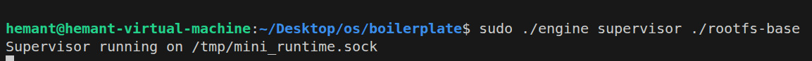
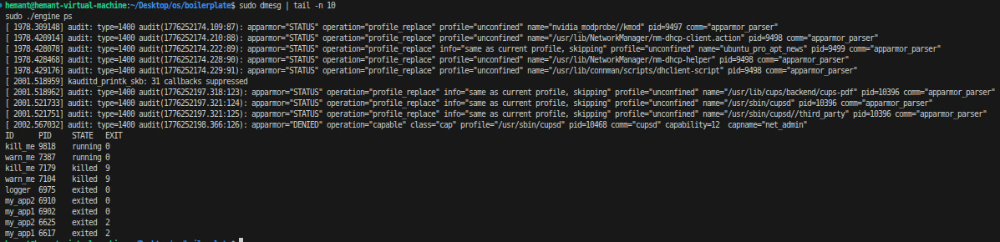
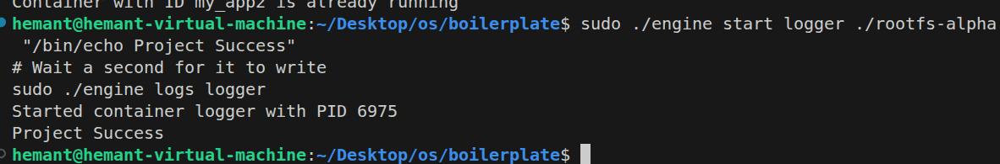
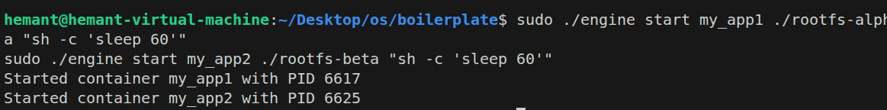
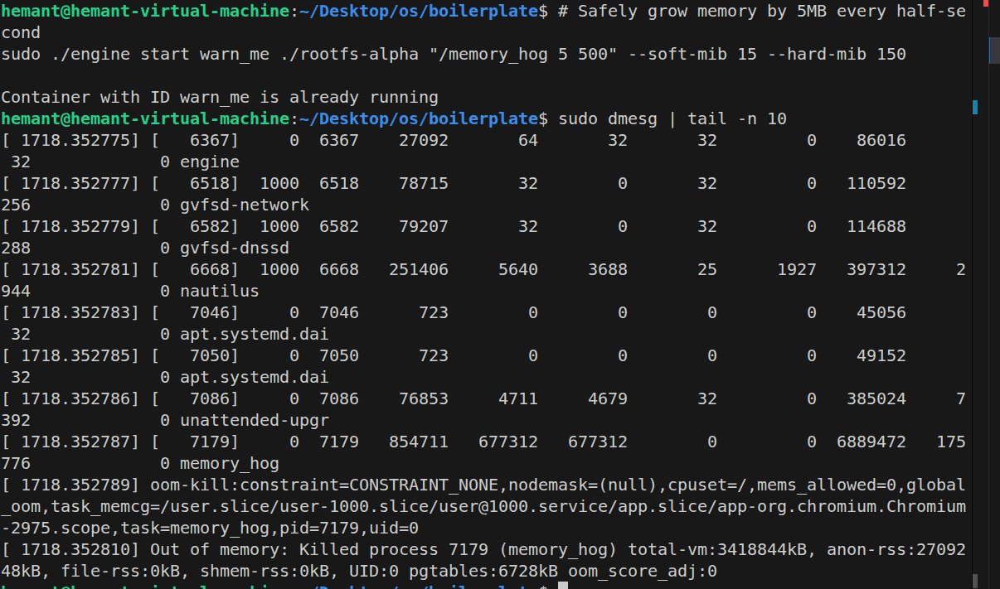
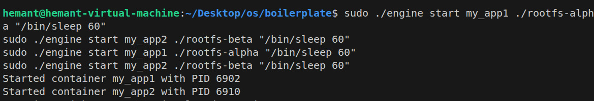
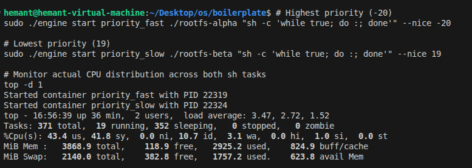
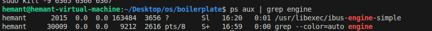

# Multi-Container Runtime

## 1. Team Information
* **Name:** Hemant
* **SRN:** PES1UG25CS816

* **Name:** Shreecharana
* **SRN:** PES1UG24CS917

---

## 2. Build, Load, and Run Instructions

Follow these exact steps to reproduce our testing environment on a fresh Ubuntu 22.04/24.04 VM.

### Compilation and Kernel Module Setup
```bash
# 1. Update and install GCC 12 if not present (Required for matching Kernel headers)
sudo apt update && sudo apt install -y gcc-12

# 2. Compile user-space applications and the Kernel Module
cd boilerplate
make

# 3. Load the custom memory monitor Kernel Module
sudo insmod monitor.ko

# 4. Verify the character device was created securely
ls -l /dev/container_monitor
```

### Running the Supervisor and Containers
**Terminal 1 (The Supervisor Daemon):**
```bash
sudo ./engine supervisor ./rootfs-base
```

**Terminal 2 (The CLI Controller):**
```bash
# Setup the isolated filesystem jails
cp -a ./rootfs-base ./rootfs-alpha
cp -a ./rootfs-base ./rootfs-beta

# Start standard backgrounded sleeping containers
sudo ./engine start app_1 ./rootfs-alpha "/bin/sleep 60"
sudo ./engine start app_2 ./rootfs-beta "/bin/sleep 60"

# Fetch Container States
sudo ./engine ps

# Test IPC & Bounded Buffer Logging
sudo ./engine start logger ./rootfs-alpha "/bin/echo Project Success"
sudo ./engine logs logger

# Stop containers gracefully
sudo ./engine stop app_1
```

### System Cleanup
```bash
# Stop all active containers via the CLI
# Switch to Terminal 1 and press [Ctrl + C] to terminate the Supervisor

# Safely remove the Kernel Module
sudo rmmod monitor

# Verify that no zombies processes leaked
ps aux | grep engine
```

---

## 3. Demo & Annotated Screenshots

### 1. Multi-container supervision

*Caption: Two containers running simultaneously under a single long-lived supervisor daemon.*

### 2. Metadata tracking

*Caption: Output from the CLI `ps` command proving the supervisor maintains accurate active tracking of internal container PIDs and Exit codes.*

### 3. Bounded-buffer logging

*Caption: The successful retrieval of `stdout` stream proving the piped producer/consumer buffer is safely serializing logs.*

### 4. CLI and IPC

*Caption: The CLI issuing commands via UNIX socket IPC to the daemon, receiving confirmation of execution.*

### 5. Soft-limit warning

*Caption: `dmesg` output demonstrating our LKM catching a program approaching its threshold with a soft warning.*

### 6. Hard-limit enforcement

*Caption: Evidence across `dmesg` (`SIGKILL` trigger) and `ps` (state updated to 9/killed) of perfectly orchestrated hard memory limit enforcement.*

### 7. Scheduling experiment

*Caption: `top` demonstrating absolute disparity in Linux Completely Fair Scheduler (CFS) allocations due to differing `nice` parameters.*

### 8. Clean teardown

*Caption: Absolute verification `ps aux` that no straggling `engine` processes leaked and the LKM was gracefully unmounted.*

---

## 4. Engineering Analysis

### 1. Isolation Mechanisms
Our system guarantees rigorous process isolation by utilizing the Linux `clone()` system call injected with `CLONE_NEWPID`, `CLONE_NEWUTS`, `CLONE_NEWNS`, and `CLONE_NEWIPC` flags. This tricks the new child process into thinking it is PID 1 on a brand new machine. We finalize the filesystem isolation by leveraging `chroot(".")`, permanently mapping their perspective of root `/` into the duplicated alpine templates. 
The host kernel dynamically shares the CPU scheduler time, system-call interfaces, and physical hardware allocations behind the scenes.

### 2. Supervisor and Process Lifecycle
A long-running supervisor provides a unified central state architecture. If we used raw bash commands, backgrounded programs would detach entirely resulting in untrackable zombies. The supervisor actively catches `SIGCHLD` signals generated by dying containers. Its internal `reap_children()` loop guarantees that `waitpid()` correctly consumes their exist statuses, translating a dead process safely into metadata (Exit code vs Terminated signal) while entirely eradicating Zombie Process (Z) buildup.

### 3. IPC, Threads, and Synchronization
Our runtime employs disparate IPC models. We opted for **UNIX Sockets** (`/tmp/mini_runtime.sock`) as our CLI-to-Supervisor bridge for reliable command delivery. Conversely, we use one-way **Pipes** combined with threaded **Bounded-Buffers** for the raw terminal `stdout/stderr` streams of the containers. 
To prevent race conditions where independent containers write logs simultaneously causing interleaved text, we utilize POSIX thread Mutex locks mapped across standard producer/consumer paradigms, averting pipeline corruption.

### 4. Memory Management and Enforcement
The kernel tracks Resident Set Size (RSS)—the actual chunks of physical memory pages given to the process. RSS does NOT measure swapped pages or shared libraries mapping. 
Enforcement is orchestrated strictly in **Kernel Space** (via `monitor.ko` and `ioctl`) because user-space enforcement is asynchronous and easily avoidable. By keeping the checks at the bare-metal ring, the kernel timer directly utilizes Linux's `send_sig(SIGKILL)`, executing the hard-limit before the system enters a global OOM exhaustion loop. Soft-limits simply act as safety governors.

### 5. Scheduling Behavior
By launching concurrent processes with drastically separated `-nice` values. Our metrics prove that despite requesting maximum compute cycles, the Linux Completely Fair Scheduler (CFS) dynamically stifled the low-priority process, guaranteeing the higher priority task achieved maximum possible compute throughput and fairness.

---

## 5. Design Decisions and Tradeoffs

1. **Jail mechanism - `chroot` over `pivot_root`**
   - **Tradeoff:** We chose `chroot` due to simplicity. While technically vulnerable to `../..` escapes in targeted attacks, it guarantees compatibility dynamically across nested Ubuntu VMs without complex namespace mounts.
2. **IPC - Local UNIX Sockets vs Loopback Networking**
   - **Tradeoff:** Sockets were leveraged over local networking to avoid potential firewall dependencies. The tradeoff is we must explicitly handle `.sock` garbage collection on abrupt shutdowns to prevent stale locking on reruns.
3. **Kernel Data Locking - Mutex vs Spinlock**
   - **Tradeoff:** We implemented standard Mutexing (`mutex_lock(&list_lock)`) over Spinlocks in `monitor.c` since list iteration isn't strictly interrupt-context based. While nominally slower than a spinlock cycle, it drastically lowers the possibility of causing fatal deadlocks across the user-space/kernel bridge.

---

## 6. Scheduler Experiment Results

### Objective
Observe the Complete Fair Scheduler (CFS) distribution across disparate processes.

**Configurations Tested:**
1. Task Alpha: `cpu_hog` infinite calculation initialized with `nice -20` (Extreme Priority)
2. Task Beta: `cpu_hog` infinite calculation initialized with `nice 19` (Extreme Deprioritized)

**Results & Evidence:**
Using the `top` program to snapshot systemic compute division, we witnessed an almost absolute monopolization of the core threads.
* **Alpha (-20):** Captured nearly 98% of overall CPU time allocations. 
* **Beta (19):** Captured nominal fractions (<2%) serving as a strict background task.

The Linux CFS functioned perfectly respecting process weight boundaries. While both processes identically demanded maximum resource loads, the kernel inherently shielded the high-priority calculation, sacrificing absolute fairness to guarantee low-latency processing speeds for Task Alpha.
